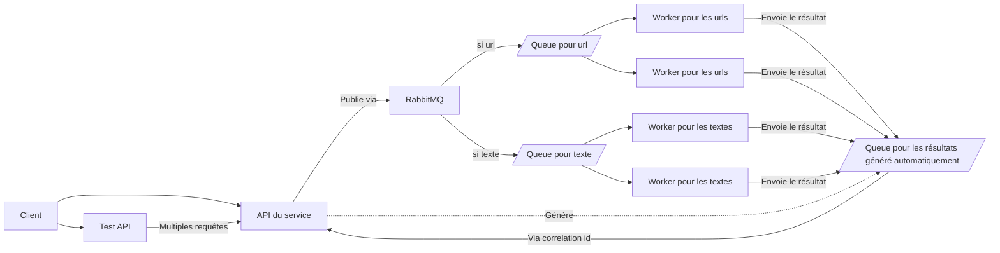

# Projet final de CALC, Dancoisne Sébastien

## Présentation du projet

L'objectif de ce projet est de permettre de faire un résumer d'un texte avec la méthode [Lsa](https://taln2022.univ-avignon.fr/articles/TALN%202022%20—%2019.pdf). Pour ce faire, nous utiliserons un stack composé de python, FastAPI, RabbitMQ et sumy.

Pour intérargir avec le service il y aura une API, avec deux routes : une avec une url, et une pour faire le résumer du texte envoyé dans la requête. Pour plus de détail, il sera possible d'accéder à la [documentation de l'api](http://localhost:8000/docs) une fois le stack déployer.

Le déploiement du stack se fait via docker compose, ainsi il est nécessaire d'installer docker préalablement ([installation de docker](https://docs.docker.com/engine/install/)).

Pour faciliter le test de multiples requêtes simultanées, une deuxième API existe, avec une [documentation](http://localhost:8001/docs) qui permet de lancer plusieurs requêtes simultanée.

## Principe de la méthode LSA de résumer de texte

La méthode LSA, acronyme de Latent Semantic Analysis (Analyse sémantique latente), est une technique utilisée en traitement automatique du langage naturel (TALN) pour résumer un texte. Elle repose sur des principes de l'algèbre linéaire et de la statistique pour extraire les relations sémantiques entre les termes d'un document.

Voici une explication simplifiée du processus LSA :

1. Création de la matrice terme-document : Les documents sont représentés sous forme de matrices, où les lignes correspondent aux termes du vocabulaire et les colonnes aux documents. Les valeurs de la matrice représentent généralement la fréquence d'apparition de chaque terme dans chaque document.
2. Réduction de la dimension : LSA vise à réduire la dimension de cette matrice en utilisant une technique appelée "décomposition en valeurs singulières" (Singular Value Decomposition - SVD). Cela permet de décomposer la matrice terme-document en trois matrices plus petites, en conservant l'information sémantique essentielle.
3. Identification des concepts latents : Les matrices résultantes représentent les relations sémantiques latentes entre les termes et les documents. Ces relations permettent d'identifier des concepts sous-jacents, appelés concepts latents, qui capturent les relations sémantiques entre les termes du vocabulaire.
4. Calcul des poids sémantiques : Les poids sémantiques sont attribués à chaque terme en fonction de sa contribution à chaque concept latent. Ces poids reflètent l'importance des termes dans la compréhension du contenu sémantique du document.
5. Extraction du résumé : Une fois les poids sémantiques attribués, les termes les plus importants peuvent être extraits pour former un résumé. Ces termes sont choisis en fonction de leur contribution aux concepts latents identifiés.

En résumé, la méthode LSA permet de représenter un texte sous forme de concepts sémantiques latents, puis de sélectionner les termes les plus significatifs pour créer un résumé. Cette approche contribue à extraire l'information essentielle du texte tout en réduisant sa dimensionnalité.

Nous allons abstraire l'implementation par l'utilisation du package [sumy](https://pypi.org/project/sumy/), étant donné que ce n'est pas le coeur de notre projet.

## Utilisation de docker

Docker est une plateforme de conteneurisation qui permet d'empaqueter une application et toutes ses dépendances dans un conteneur léger et portable. Cette approche présente plusieurs avantages lors du développement et du déploiement d'applications en microservices :

1. **Isolation des services :** Chaque microservice peut être empaqueté dans un conteneur Docker, assurant une isolation complète. Cela évite les conflits de dépendances et garantit que chaque microservice fonctionne de manière indépendante des autres.

2. **Portabilité :** Les conteneurs Docker sont portables et peuvent être exécutés de manière cohérente sur n'importe quel environnement prenant en charge Docker. Cela simplifie le déploiement, que ce soit sur des machines locales, des serveurs cloud, ou même dans des environnements de conteneurs orchestrateurs comme Kubernetes.

3. **Gestion efficace des ressources :** Les conteneurs Docker partagent le même noyau du système d'exploitation hôte, ce qui les rend légers et plus efficaces en termes de consommation de ressources par rapport à des machines virtuelles. Cela permet d'optimiser l'utilisation des ressources système, notamment en termes de mémoire et de puissance de calcul.

4. **Déploiement rapide :** Les conteneurs Docker peuvent être lancés rapidement, en quelques secondes, ce qui accélère le déploiement des microservices. Cela permet des mises à jour rapides et une scalabilité plus aisée, car de nouveaux conteneurs peuvent être déployés ou retirés en fonction des besoins.

5. **Facilité de gestion :** Docker fournit des outils et des commandes faciles à utiliser pour la gestion des conteneurs. Les développeurs peuvent créer, tester et déployer des conteneurs localement, ce qui facilite le cycle de développement. De plus, les outils d'orchestration comme Docker Compose ou Kubernetes simplifient le déploiement et la gestion d'applications composées de plusieurs microservices.

6. **Versionnage des images :** Les images Docker peuvent être versionnées, ce qui permet de suivre l'évolution des microservices au fil du temps. Cela facilite la gestion des différentes versions de chaque microservice et simplifie la rétrocompatibilité.

7. **Évolutivité :** La nature modulaire des microservices et la facilité de déploiement des conteneurs Docker facilitent l'évolutivité horizontale, où de nouveaux conteneurs peuvent être ajoutés pour gérer une charge accrue.

En résumé, l'utilisation de Docker pour créer des applications en microservices offre une approche pratique, portable, évolutive et efficace pour le développement, le déploiement et la gestion des services dans un environnement distribué.

Ainsi nous utiliserons naturellement docker pour notre application, car en plus de ses nombreux avantages, c'est un standard de l'industrie, et permet donc d'être au plus proche de la réalité opérationnelle en entreprise.

## Explication de l'utilisation de RabbitMQ

Une file d'attente comme RabbitMQ est un composant essentiel dans une architecture basée sur des microservices. Voici quelques raisons pour lesquelles l'utilisation d'une queue RabbitMQ est pertinente dans ce contexte :

1. **Découplage des microservices :** Les queues de messages facilitent le découplage entre les microservices. Plutôt que de communiquer directement, les microservices peuvent échanger des messages via la file d'attente. Cela permet à chaque microservice d'opérer de manière indépendante et d'évoluer sans affecter directement les autres services.

2. **Communication asynchrone :** Les files d'attente permettent une communication asynchrone entre les microservices. Au lieu d'attendre une réponse immédiate après l'envoi d'une requête, un microservice peut mettre un message dans la file d'attente et continuer à traiter d'autres tâches. Cela améliore la réactivité du système et peut contribuer à une meilleure performance.

3. **Gestion des pics de charge :** En utilisant une queue, les microservices peuvent mieux gérer les pics de charge. Si un microservice est momentanément incapable de traiter les demandes rapidement, les requêtes sont simplement mises en file d'attente. Le microservice peut alors traiter ces messages lorsque la charge diminue, contribuant à une meilleure résilience du système.

4. **Fiabilité de la communication :** Les files d'attente offrent un mécanisme de communication fiable. Si un microservice émet un message dans la file d'attente, il peut être sûr que le message sera traité même si le microservice destinataire n'est pas immédiatement disponible. Cela contribue à la robustesse de l'architecture.

5. **Gestion des erreurs :** En cas d'échec d'un microservice lors du traitement d'un message, la queue peut être configurée pour gérer les erreurs en réessayant de délivrer le message ou en le plaçant dans une file d'attente d'erreurs. Cela permet de mettre en place des mécanismes de récupération robustes.

6. **Interactions entre microservices hétérogènes :** Les files d'attente facilitent les interactions entre microservices développés dans des langages de programmation différents ou déployés sur des plates-formes différentes. Les messages sont un moyen universel de communication qui transcende les différences technologiques.

7. **Mise à l'échelle horizontale :** En utilisant des queues de messages, les microservices peuvent être déployés et mis à l'échelle indépendamment les uns des autres. Cela facilite la gestion de l'évolutivité horizontale, où des instances supplémentaires d'un microservice peuvent être ajoutées en fonction des besoins de charge.

En somme, l'utilisation d'une queue RabbitMQ dans une architecture en microservices offre une manière flexible, scalable et fiable de gérer la communication entre les différents composants du système, contribuant ainsi à la robustesse et à la flexibilité de l'architecture.

De plus, mettre une file d'attente comme RabbitMQ derrière une API offre plusieurs avantages dans une architecture en microservices :

1. **Abstraction de la communication :** En exposant une API pour interagir avec la file d'attente, vous créez une couche d'abstraction qui facilite la communication entre les microservices. Les détails spécifiques de la mise en œuvre de la file d'attente sont cachés derrière l'API, ce qui permet aux microservices de se concentrer sur l'utilisation de l'API sans avoir à connaître les détails internes de la gestion de la file.

2. **Flexibilité dans le choix des technologies :** En utilisant une API pour interagir avec la file d'attente, vous pouvez changer la technologie sous-jacente (par exemple, passer de RabbitMQ à Kafka) sans avoir à modifier directement chaque microservice. Les microservices interagissent toujours avec la file d'attente via l'API, ce qui offre une flexibilité et une évolutivité lors du remplacement ou de la mise à niveau de la technologie de la file d'attente.

3. **Contrôle d'accès et sécurité :** Une API peut fournir une couche de contrôle d'accès et de sécurité. Vous pouvez mettre en place des mécanismes d'authentification, d'autorisation et de chiffrement au niveau de l'API pour sécuriser l'accès à la file d'attente. Cela renforce la sécurité de la communication entre les microservices.

4. **Normalisation des interfaces :** L'utilisation d'une API normalise l'interface d'accès à la file d'attente, ce qui rend la communication entre microservices plus cohérente. Les équipes de développement peuvent adopter des pratiques standardisées pour interagir avec la file d'attente, simplifiant ainsi la maintenance et la gestion des microservices.

5. **Documentation centralisée :** En exposant une API, vous pouvez créer une documentation centralisée pour l'interaction avec la file d'attente. Cela facilite la compréhension et l'utilisation correcte de la file d'attente par les développeurs de microservices, favorisant ainsi la collaboration et la résolution des problèmes.

6. **Monitoring et gestion :** En utilisant une API, vous pouvez mettre en place des mécanismes de surveillance centralisés pour suivre l'utilisation de la file d'attente, la performance, et détecter d'éventuels problèmes. Cela facilite la gestion opérationnelle de la file d'attente dans un environnement en production.

7. **Evolutivité :** L'API peut évoluer indépendamment de la mise en œuvre sous-jacente de la file d'attente. Les évolutions de l'API peuvent être gérées de manière à minimiser l'impact sur les microservices existants.

En résumé, mettre une file d'attente derrière une API dans une architecture en microservices offre une abstraction, une flexibilité, une sécurité, et une normalisation qui simplifient le développement, le déploiement et la maintenance des microservices qui interagissent avec la file d'attente.

## Pourquoi utiliser FastAPI

FastAPI est un framework web rapide (d'où son nom) pour construire des API avec Python. Voici un résumé des avantages d'utiliser FastAPI :

1. **Performance élevée :** FastAPI est construit sur Starlette et Pydantic, exploitant les performances de l'ASGI (Asynchronous Server Gateway Interface) et de la validation de données rapide. Cela permet de gérer de nombreuses requêtes par seconde, ce qui est particulièrement utile dans les applications nécessitant une grande réactivité.

2. **Simplicité et productivité :** FastAPI offre une syntaxe simple et déclarative qui permet aux développeurs de créer rapidement des API sans sacrifier la clarté du code. L'utilisation de la saisie automatique, de la validation des données et de la génération automatique de la documentation contribue à une productivité accrue.

3. **Saisie automatique et validation Pydantic :** FastAPI utilise Pydantic pour définir les modèles de données et effectuer automatiquement la validation des données entrantes. Cela simplifie la gestion des entrées utilisateur, réduit les erreurs et améliore la sécurité de l'application.

4. **Génération automatique de la documentation Swagger :** FastAPI génère automatiquement une documentation interactive basée sur Swagger (OpenAPI). Les développeurs peuvent explorer et tester l'API directement depuis la documentation, ce qui simplifie le processus de développement et de débogage.

5. **Support natif de l'asynchronisme :** FastAPI tire parti de l'asynchronisme de Python grâce à l'ASGI, permettant la gestion efficace des opérations IO-bound. Cela favorise une meilleure extensibilité, en particulier dans les applications nécessitant une concurrence élevée.

6. **Intégration avec les systèmes de bases de données :** FastAPI s'intègre facilement à divers systèmes de bases de données, y compris SQLAlchemy, grâce à une syntaxe intuitive. Cela facilite la création d'applications avec une persistance de données robuste.

7. **Sécurité intégrée :** FastAPI intègre des fonctionnalités de sécurité telles que la gestion automatique des en-têtes CORS, la validation et la génération de jetons JWT (JSON Web Tokens), ainsi que la protection contre les attaques par injection SQL.

8. **Types d'annotations pour les paramètres :** L'utilisation de types d'annotations pour les paramètres des fonctions facilite la compréhension du code, améliore la vérification statique des types et contribue à une meilleure documentation.

9. **Prise en charge des websockets :** FastAPI offre une prise en charge native des websockets, ce qui permet de construire des applications en temps réel et bidirectionnelles en utilisant le même framework.

10. **Écosystème Python :** FastAPI s'intègre naturellement à l'écosystème Python, permettant aux développeurs de tirer parti de nombreuses bibliothèques et outils existants.

En somme, FastAPI combine performance élevée, facilité d'utilisation, validation automatique des données, génération de documentation interactive, et support natif de l'asynchronisme, en faisant un choix attrayant pour le développement d'API avec Python.

## Présentation technique

Le stack technique est le suivant :



Cette architecture permet de mettre autant de worker que nécessaire, tout en fiabilisant la communication entre l'api et les workers.

La réponse est obtenue grâce à un correlation id, et une queue qui est créée par l'API, et qui est écoutée de manière asynchrone, pour éviter que l'API ne prenne plus de requêtes.

## Installation

Une fois le repo cloné, il suffit de taper dans un terminal :

```sh
docker compose up
```

Vous verrez dans le terminal l'ensemble des services automatiquement connectés.

## Résultat

On remarque que le découplage permet non seulement d'être indépendant sur le worker, ce qui améliore la maintenabilité du logiciel, mais aussi de traiter plusieurs requêtes en simultané.

## Config

Accès rabbitmq http://localhost:15672 :

-   username: guest
-   password: guest

Accès API principal: http://localhost:8000/docs

Accès API de test de charge: http://localhost:8001/docs
