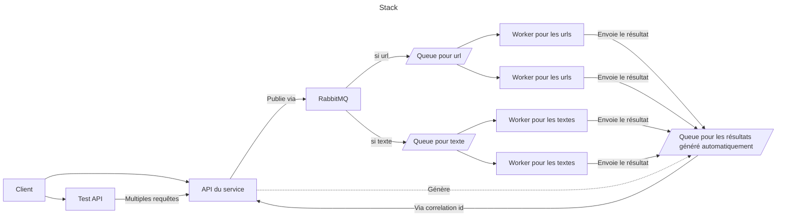

# Projet final de CALC, Dancoisne Sébastien

## Présentation du projet

L'objectif de ce projet est de permettre de faire un résumer d'un texte avec la méthode [Lsa](https://taln2022.univ-avignon.fr/articles/TALN%202022%20—%2019.pdf). Pour ce faire, nous utiliserons un stack composé de python, FastAPI, RabbitMQ et sumy.

Pour intérargir avec le service il y aura une API, avec deux routes : une avec une url, et une pour faire le résumer du texte envoyé dans la requête. Pour plus de détail, il sera possible d'accéder à la [documentation de l'api](http://localhost:8000/docs) une fois le stack déployer.

Le déploiement du stack se fait via docker compose, ainsi il est nécessaire d'installer docker préalablement ([installation de docker](https://docs.docker.com/engine/install/)).

Pour faciliter le test de multiples requêtes simultanées, une deuxième API existe, avec une [documentation](http://localhost:8001/docs) qui permet de lancer plusieurs requêtes simultanée.

## Présentation technique

Le stack technique est le suivant :



Cette architecture permet de mettre autant de worker que nécessaire, tout en fiabilisant la communication entre l'api et les workers.

La réponse est obtenue grâce à un correlation id, et une queue qui est créée par l'API, et qui est écoutée de manière asynchrone, pour éviter que l'API ne prenne plus de requêtes.

## Installation

Une fois le repo cloné, il suffit de taper dans un terminal :

```sh
docker compose up
```

Vous verrez dans le terminal l'ensemble des services automatiquement connectés.

## Résultat

On remarque que le découplage permet non seulement d'être indépendant sur le worker, ce qui améliore la maintenabilité du logiciel, mais aussi de traiter plusieurs requêtes en simultané.
